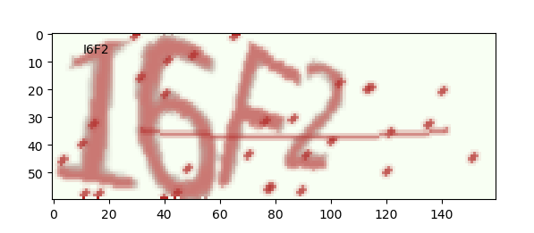
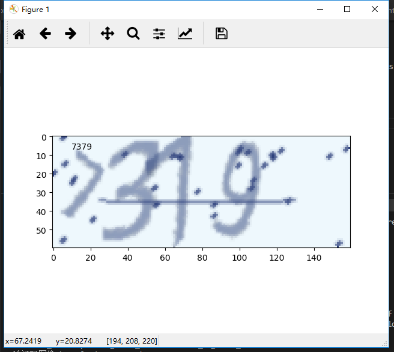
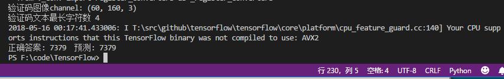

# 使用深度学习来破解 captcha 验证码
基于TensorFlow搭建一个深度卷积神经网络来识别 captcha 验证码，进行验证码的自动生成和训练识别 成功率破 95%以上 台式i5机 训练耗时 2天
## Prerequisites:

1. 需要安装Tensorflow以及captcha库
2. 需要安装matplotlib库


# 实例截图



验证码实例



程序预测结果实例


# 数据生成器

训练模型的时候，我们可以选择两种方式来生成我们的训练数据，一种是一次性生成几万张图，然后开始训练，一种是定义一个数据生成器，然后利用 `train_crack_captcha_cnn` 函数来训练。

第一种方式的好处是训练的时候显卡利用率高，如果你需要经常调参，可以一次生成，多次使用；第二种方式的好处是你不需要生成大量数据，训练过程中可以利用 CPU 生成数据，而且还有一个好处是你可以无限生成数据。

我们的数据格式如下：

## captcha_text

captcha_text是随机选出的字母或者数字，作为生产验证码的答案

## captcha_image

captcha_text是随机选出的字母或者数字生产的图像

```py

def gen_captcha_text_and_image():
    image = ImageCaptcha()

    captcha_text = random_captcha_text()
    captcha_text = ''.join(captcha_text)

    captcha = image.generate(captcha_text)
    # image.write(captcha_text, captcha_text + '.jpg')  # 写到文件

    captcha_image = Image.open(captcha)
    captcha_image = np.array(captcha_image)
    return captcha_text, captcha_image

```

上面就是一个可以无限生成数据的例子，我们将使用这个生成器来训练我们的模型。

# 使用生成器

生成器的使用方法很简单，只需要用 gen_captcha_text_and_image 函数即可。下面是一个例子，生成1个数据，然后显示该数据。

```py
    text, image = gen_captcha_text_and_image()
    f = plt.figure()
    ax = f.add_subplot(111)
    ax.text(0.1, 0.9, text, ha='center', va='center', transform=ax.transAxes)
    plt.imshow(image)
    plt.show()
```

# 构建神经网络

```py
# 定义CNN
def crack_captcha_cnn(w_alpha=0.01, b_alpha=0.1):
    x = tf.reshape(X, shape=[-1, IMAGE_HEIGHT, IMAGE_WIDTH, 1])
 
    # 3 conv layer
    w_c1 = tf.Variable(w_alpha*tf.random_normal([3, 3, 1, 32]))
    b_c1 = tf.Variable(b_alpha*tf.random_normal([32]))
    conv1 = tf.nn.relu(tf.nn.bias_add(tf.nn.conv2d(x, w_c1, strides=[1, 1, 1, 1], padding='SAME'), b_c1))
    conv1 = tf.nn.max_pool(conv1, ksize=[1, 2, 2, 1], strides=[1, 2, 2, 1], padding='SAME')
    conv1 = tf.nn.dropout(conv1, keep_prob)
 
    w_c2 = tf.Variable(w_alpha*tf.random_normal([3, 3, 32, 64]))
    b_c2 = tf.Variable(b_alpha*tf.random_normal([64]))
    conv2 = tf.nn.relu(tf.nn.bias_add(tf.nn.conv2d(conv1, w_c2, strides=[1, 1, 1, 1], padding='SAME'), b_c2))
    conv2 = tf.nn.max_pool(conv2, ksize=[1, 2, 2, 1], strides=[1, 2, 2, 1], padding='SAME')
    conv2 = tf.nn.dropout(conv2, keep_prob)
 
    w_c3 = tf.Variable(w_alpha*tf.random_normal([3, 3, 64, 64]))
    b_c3 = tf.Variable(b_alpha*tf.random_normal([64]))
    conv3 = tf.nn.relu(tf.nn.bias_add(tf.nn.conv2d(conv2, w_c3, strides=[1, 1, 1, 1], padding='SAME'), b_c3))
    conv3 = tf.nn.max_pool(conv3, ksize=[1, 2, 2, 1], strides=[1, 2, 2, 1], padding='SAME')
    conv3 = tf.nn.dropout(conv3, keep_prob)
 
    # Fully connected layer
    w_d = tf.Variable(w_alpha*tf.random_normal([8*20*64, 1024]))
    b_d = tf.Variable(b_alpha*tf.random_normal([1024]))
    dense = tf.reshape(conv3, [-1, w_d.get_shape().as_list()[0]])
    dense = tf.nn.relu(tf.add(tf.matmul(dense, w_d), b_d))
    dense = tf.nn.dropout(dense, keep_prob)
 
    w_out = tf.Variable(w_alpha*tf.random_normal([1024, MAX_CAPTCHA*CHAR_SET_LEN]))
    b_out = tf.Variable(b_alpha*tf.random_normal([MAX_CAPTCHA*CHAR_SET_LEN]))
    out = tf.add(tf.matmul(dense, w_out), b_out)
    #out = tf.nn.softmax(out)
    return out
 
```

模型结构很简单，特征提取部分使用的是3f个 conv layer，一个Fully connected layer的结构，这个结构是学的 CNN 的结构,CNN需要大量的样本进行训练，由于时间和资源有限，测试时我只使用数字做为验证码字符集。如果使用数字+大小写字母CNN网络有4*62个输出，只使用数字CNN网络有4*10个输出。


# 训练模型

这里的验证集使用了同样的生成器，由于数据是通过生成器随机生成的，所以我们不用考虑数据是否会重复。注意，这段代码在笔记本上可能要耗费一下午时间。如果你想让模型预测得更准确，可以将 `acc` 改为 0.5 或者 0.6，但它也将耗费大量的时间。

```py
def train_crack_captcha_cnn():
    output = crack_captcha_cnn()
    # loss
    #loss = tf.reduce_mean(tf.nn.softmax_cross_entropy_with_logits(output, Y))
    loss = tf.reduce_mean(tf.nn.sigmoid_cross_entropy_with_logits(logits=output, labels=Y))
        # 最后一层用来分类的softmax和sigmoid有什么不同？
    # optimizer 为了加快训练 learning_rate应该开始大，然后慢慢衰
    optimizer = tf.train.AdamOptimizer(learning_rate=0.001).minimize(loss)
 
    predict = tf.reshape(output, [-1, MAX_CAPTCHA, CHAR_SET_LEN])
    max_idx_p = tf.argmax(predict, 2)
    max_idx_l = tf.argmax(tf.reshape(Y, [-1, MAX_CAPTCHA, CHAR_SET_LEN]), 2)
    correct_pred = tf.equal(max_idx_p, max_idx_l)
    accuracy = tf.reduce_mean(tf.cast(correct_pred, tf.float32))
 
    saver = tf.train.Saver()
    with tf.Session() as sess:
        sess.run(tf.global_variables_initializer())
 
        step = 0
        while True:
            batch_x, batch_y = get_next_batch(64)
            _, loss_ = sess.run([optimizer, loss], feed_dict={X: batch_x, Y: batch_y, keep_prob: 0.75})
            print("step is %s , loss is %g" % (step, loss_))
            
            # 每100 step计算一次准确率
            if step % 100 == 0:
                batch_x_test, batch_y_test = get_next_batch(100)
                acc = sess.run(accuracy, feed_dict={X: batch_x_test, Y: batch_y_test, keep_prob: 1.})
                print("----------step is %s , acc is %g--------" % (step, acc))
                # 计算力和时间有限，如果准确率大于90%,保存模型,完成训练，
                if acc > 0.9:
                    saver.save(sess, 'crack_capcha_model/crack_capcha.model', global_step=step)
                    break
 
            step += 1
```

# 训练模型

由于 sigmoid 收敛很慢，所以我们需要设置比较大的代数，这里我们设置的是以最后的精确度为标准，我在这个基础上继续训练了一次，在了2563代，得到了90%的准确率.

```py
 while True:
            batch_x, batch_y = get_next_batch(64)
            _, loss_ = sess.run([optimizer, loss], feed_dict={X: batch_x, Y: batch_y, keep_prob: 0.75})
            print("step is %s , loss is %g" % (step, loss_))
            
            # 每100 step计算一次准确率
            if step % 100 == 0:
                batch_x_test, batch_y_test = get_next_batch(100)
                acc = sess.run(accuracy, feed_dict={X: batch_x_test, Y: batch_y_test, keep_prob: 1.})
                print("----------step is %s , acc is %g--------" % (step, acc))
                # 计算力和时间有限，如果准确率大于90%,保存模型,完成训练，
                if acc > 0.9:
                    saver.save(sess, 'crack_capcha_model/crack_capcha.model', global_step=step)
                    break
 
            step += 1
```


# 测试模型

当我们训练完成以后，可以识别一个验证码试试看：

```py


# 训练完成后使用下列检验效果的代码
if __name__ == '__main__':
    text, image = gen_captcha_text_and_image()
    f = plt.figure()
    ax = f.add_subplot(111)
    ax.text(0.1, 0.9, text, ha='center', va='center', transform=ax.transAxes)
    plt.imshow(image)
    image = convert2gray(image)
    image = image.flatten() / 255
    predict_text = crack_captcha(image)
    plt.show()
```


# 模型总结

模型的大小是16MB，在我的笔记本上跑1000张验证码需要用20秒，当然，显卡会更快。对于验证码识别的问题来说，哪怕是10%的准确率也已经称得上破解，毕竟假设100%识别率破解要一个小时，那么10%的识别率也只用十个小时，还算等得起，而我们的识别率有90%，已经可以称得上完全破解了这类验证码。


